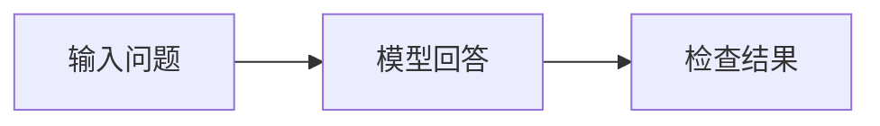
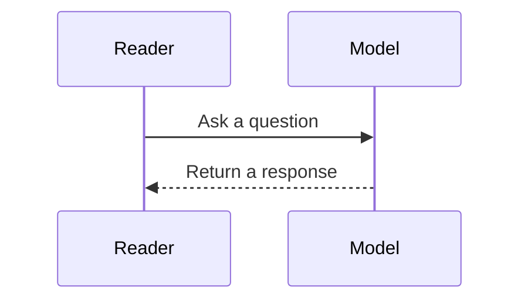
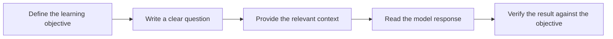

```mermaid
flowchart LR
  accTitle: Learning flow
  accDescr: A question becomes an input, a model response, and a checked result.
  A[输入问题] --> B[模型回答] --> C[检查结果]
```


```mermaid
sequenceDiagram
  accTitle: Question and response
  accDescr: A reader asks a model a question and checks its response.
  participant Reader
  participant Model
  Reader->>Model: Ask a question
  Model-->>Reader: Return a response
```


```mermaid
flowchart LR
  accTitle: Learning flow
  accDescr: Each step preserves enough context for the next step.
  A[Define the learning objective] --> B[Write a clear question]
  B --> C[Provide the relevant context]
  C --> D[Read the model response]
  D --> E[Verify the result against the objective]
```

```text
flowchart LR
  A[Literal source] --> B[Still code]
```
